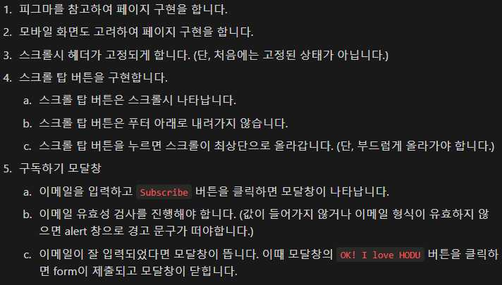
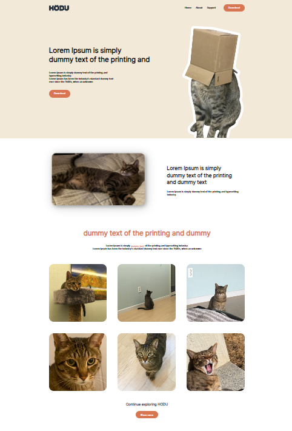
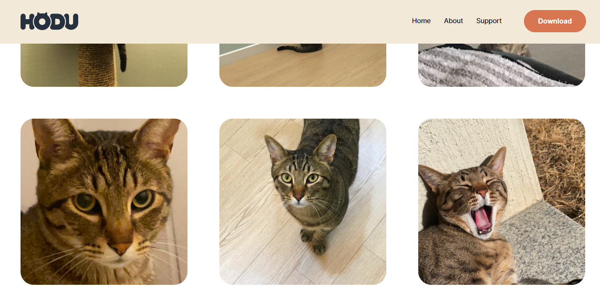
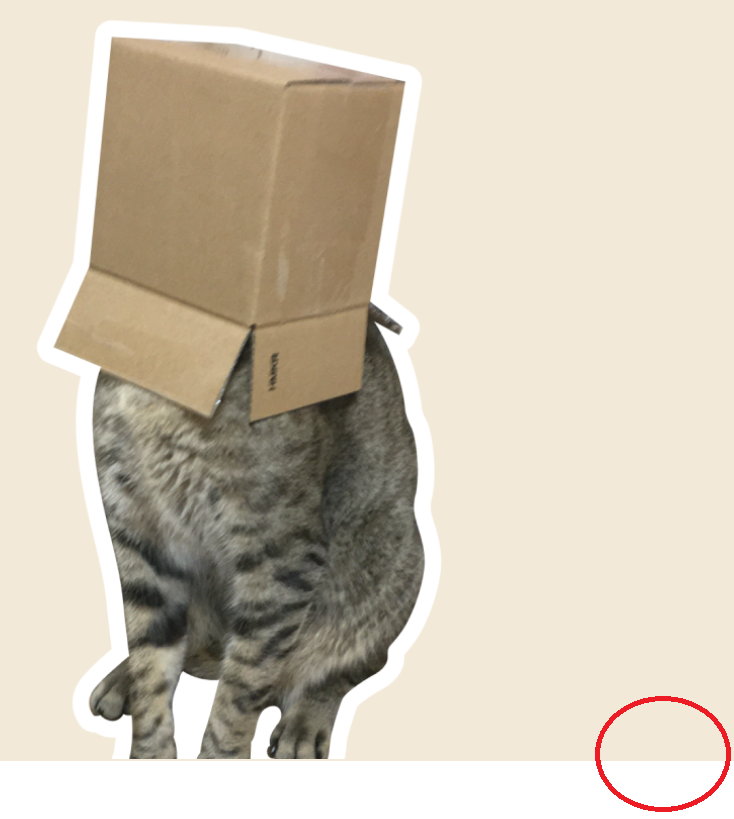
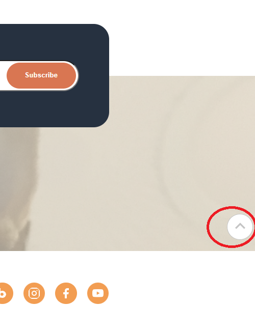
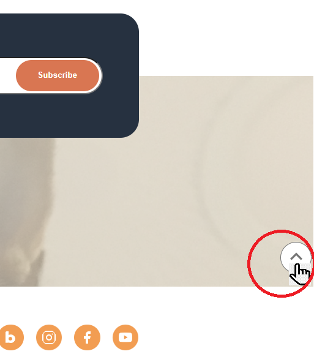
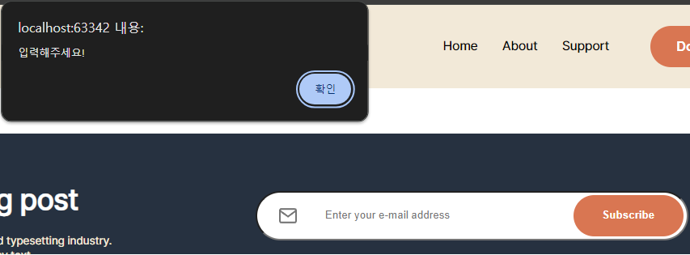
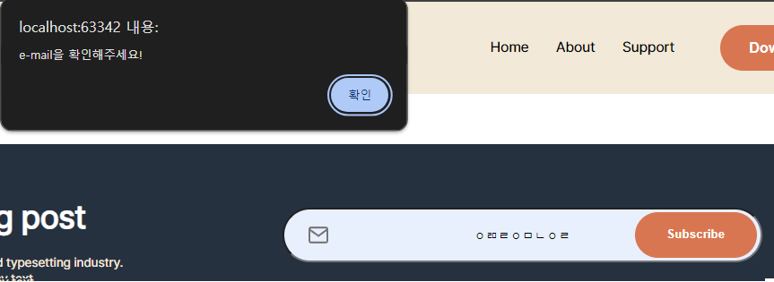
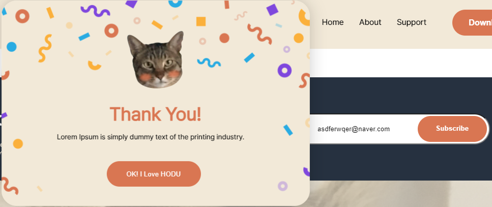

# 오르미 6기 백엔드 과정 FE project.
훈련기간 중 이루어진 첫 project 소개
***
### 프론트엔드
백엔드 과정에서 프론트엔드관련 지식을 왜?  
기본적인 프론트엔드 지식을 갖는 데에는 이유가 있다고 한다.
1. 협업시에 원할한 소통을 할 수 있고, 더 일관성이 있는 코드 작성을 하는데 도움이 됨.
2. 프론트엔드 필요에 맞는 방식으로 설계 하며 성능을 최적화 할 수 있음.
3. 프론트엔드와 백엔드의 상호작용을 이해하면 문제의 원인을 더 쉽게 파악가능.
4. 사용자의 경험을 더 잘 이해 할수 있어, 사용자 중심으로 설계하며 결과적으로 더 좋은 결과물을 만들 수 있다.
5. 후에 풀스택개발자로 성장 할 수 있는 가능성이 있음.
***
## 목표
figma링크와 요구사항을 참고하여 HODU를 소개하는 페이지 만들기  

### ['HODU'page살펴보기](https://sangwon-lee1.github.io/Oreumi_6th_FE_project/FE%20project/FEproject.html)

***
## 요구사항 명세

***
### 사용한 스택

***
## 구현 기능
### 1. pc화면 // 모바일 화면 구현

 
 

### 2. 스크롤시 헤더 고정

 
 

### 3. 스크롤 탑 버튼 구현
1. 초기에 보이지않고 스크롤시 나타남.
2. footer 아래로는 내려가지 않음.
3. hover시 버튼 진해짐
4. 버튼 클릭시 부드럽게 최상단으로 올라감.

 
 

### 4. 구독하기 모달창 구현
1. 이메일 유효성 검사 진행
2. 값이 없을시 경고창
3. 이메일 형식이 아닐 시 경고창
4. 문제 없을 시 모달창 화면 뜸.(모달창의 버튼을 클릭하면 form 제출)

***

## project 후기
1. figma를 보며 작업 중 원하는 모습처럼 잘 되지 않았음.  
👉해결하기 위해 수정작업을 많이 하며, 시작전에 각각 구역 나누기와 html 태그 구성의 중요함을 알게 되었음.  
2. 처음 접해보는 html, css, JS를 공부함에 있어 많은정보량과 생소한용어들에 어려움을 느꼈지만,  
직접 실습하며 안되고 모르는 것을 완벽하지는 않지만 해결해가는 순간들이 재밌어서 시간가는 줄 모르게 지난 프로젝트였음.
3. 앞으로도 꾸준히 공부하여 하나씩이라도 내것으로 만들겠다고 스스로 다짐하였음.